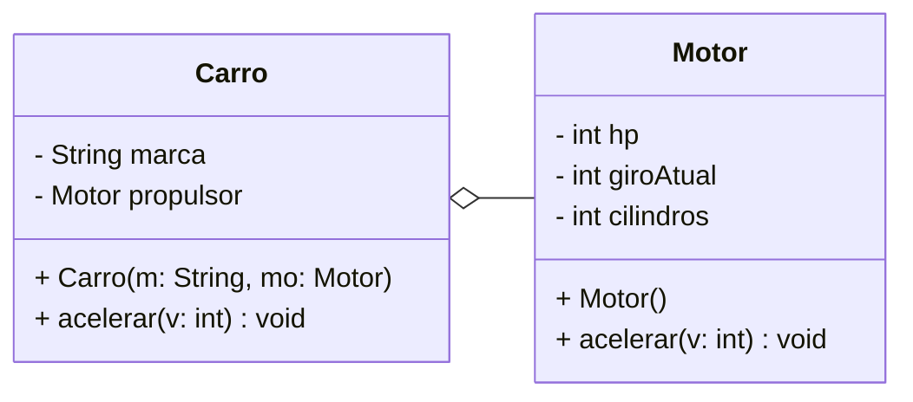

# Diagrama de Classes UML

## Código Java

```java
public class Carro {
    
    private String marca;
    private Motor propulsor;

    public Carro(String m, Motor mo) {
        this.marca = m;
        this.propulsor = mo;
    }

    public void acelerar(int v) {
        this.propulsor.acelerar(v);
    }

    public void trocarMotor(Motor mo) {
        this.propulsor = mo;
    }
}

public class Motor {
    
    private int hp;
    private int giroAtual;
    private int cilindros;

    public void acelerar(int v) {

    }
}
```

## Diagrama UML


