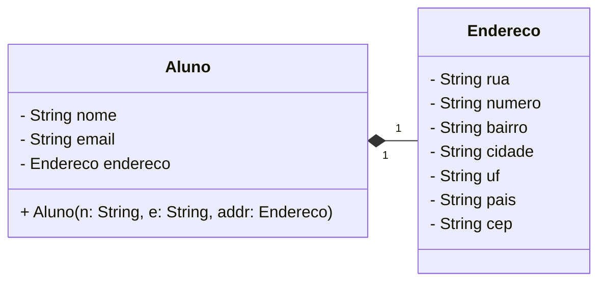
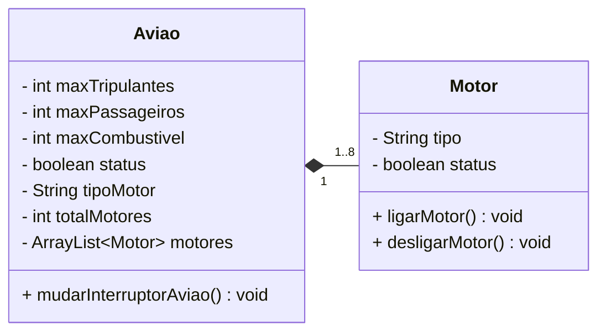

# Diagrama de Classes UML

## Classes Aluno e Endereco

### Código Java

```java
public class Aluno {
    
    private String nome;
    private String email;
    private Endereco endereco;
    
    public Aluno(String nome, String email, Endereco endereco) {
        this.nome = nome;
        this.email = email;
        this.endereco = endereco;
    }
}

public class Endereco {
    
    private String rua;
    private String numero;
    private String bairro;
    private String cidade;
    private String uf;
    private String pais;
    private String cep;
    
    public Endereco(String rua, String numero, String bairro, String cidade, String uf, String pais, String cep) {
        this.rua = rua;
        this.numero = numero;
        this.bairro = bairro;
        this.cidade = cidade;
        this.uf = uf;
        this.pais = pais;
        this.cep = cep;
    }
}
```

### Diagrama UML



## Classes Aviao e Motor

### Código Java

```java
public class Aviao {
    
    private int maxTripulantes;
    private int maxPassageiros;
    private int maxCombustivel;
    private boolean status;
    private String tipoMotor;
    private int totalMotores;
    private ArrayList<Motor> motores;
    
    public Aviao(int maxTripulantes, int maxPassageiros, int maxCombustivel, String tipoMotor, int totalMotores) {
        this.maxTripulantes = maxTripulantes;
        this.maxPassageiros = maxPassageiros;
        this.maxCombustivel = maxCombustivel;
        this.status = false;

        ArrayList<Motor> motores = new ArrayList<>();

        for (int i = 0; i < totalMotores; i++) {
            motores.add(new Motor(tipoMotor));
        }
    }
 
    public void mudarInterruptorAviao() {
        
        if (this.status = false) {
            this.status = true;
        
            for (Motor motor : this.motores) {
                motor.ligarMotor();
            }

            IO.println("Avião ligado.");
        } else { 
            this.status = false;

            for (Motor motor : this.motores) {
                motor.desligarMotor();
            }

            IO.println("Avião desligado");
        }
    }
}

public class Motor {
    
    private String tipo;
    private boolean status;
    
    public Motor(String tipo) {
        this.tipo = tipo;
        this.status = false;
    }

    public void ligarMotor() {
        this.status = true;
        IO.println("Motor ligado.");
    }
    
    public void desligarMotor() {
        this.status = false;
        IO.println("Motor desligado");
    }
}
```

### Diagrama UML

