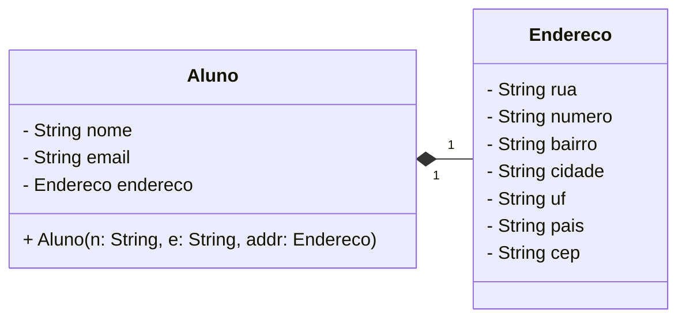
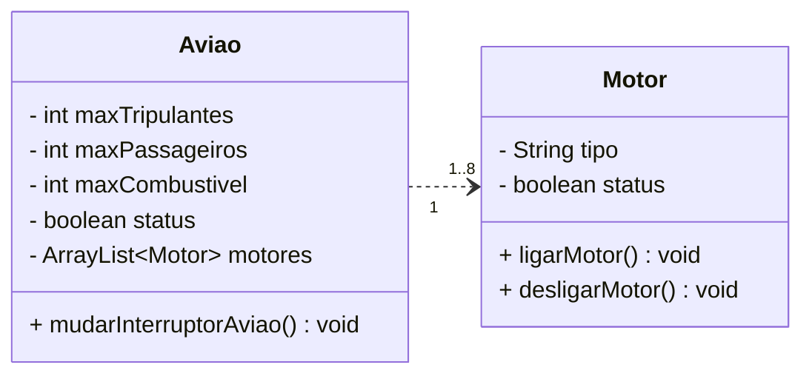

# Diagrama de Classes UML

## Código Java

```java
public class Aviao {
    
    private int maxTripulantes;
    private int maxPassageiros;
    private int maxCombustivel;
    private boolean status;
    private ArrayList<Motor> motores;
    
    public Aviao(int maxTripulantes, int maxPassageiros, int maxCombustivel, boolean status, ArrayList<Motor> motores) {
        this.maxTripulantes = maxTripulantes;
        this.maxPassageiros = maxPassageiros;
        this.maxCombustivel = maxCombustivel;
        this.status = status;
        this.motores = motores;
    }
 
    public void mudarInterruptorAviao() {
        
        if (this.status = false) {
            
            this.status = true;
        
            for (Motor motor : motores) {
                motor.ligarMotor();
            }

            IO.println("Avião ligado.");

        } else {
            
            this.status = false;

            for (Motor motor : motores) {
                motor.desligarMotor();
            }

            IO.println("Avião desligado");
        }
    }
}

public class Motor {
    
    private String tipo;
    private boolean status;
    
    public Motor(String tipo, boolean status) {
        this.tipo = tipo;
        this.status = status;
    }

    public void ligarMotor() {
        this.status = true;
        IO.println("Motor ligado.");
    }
    
    public void desligarMotor() {
        this.status = false;
        IO.println("Motor desligado");
    }
}
```

## Diagrama UML



