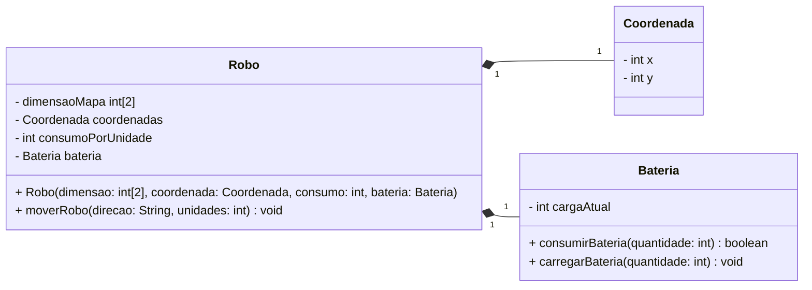

# Diagrama de Classes UML

## Código Java

```java
public class Robo {
    
    private int[] dimensaoMapa = new int[2];
    private Coordenada coordenadas;
    private int consumoPorUnidade;
    private Bateria bateria;
    
    public Robo(int[] dimensaoMapa, Coordenada coordenadas, int consumoPorUnidade, Bateria bateria) {
        this.dimensaoMapa = dimensaoMapa;
        this.coordenadas = coordenadas;
        this.consumoPorUnidade = consumoPorUnidade;
        this.bateria = bateria;
    }

    public void moverRobo(String direcao, int unidades) {

        // Verificar bateria antes de mover

        switch (direcao) {
            case "N" -> dimensaoMapa[1] += unidades;
            case "S" -> dimensaoMapa[1] -= unidades;
            case "L" -> dimensaoMapa[0] += unidades;
            case "O" -> dimensaoMapa[0] -= unidades;
        }
    }
}

public class Coordenada {
    
    private int x;
    private int y;
    
    public Coordenada(int x, int y) {
        this.x = x;
        this.y = y;
    }
}

public class Bateria {
    
    private int cargaAtual;

    public Bateria(int energia) {
        this.cargaAtual = energia;
    }

}
```

## Diagrama UML

