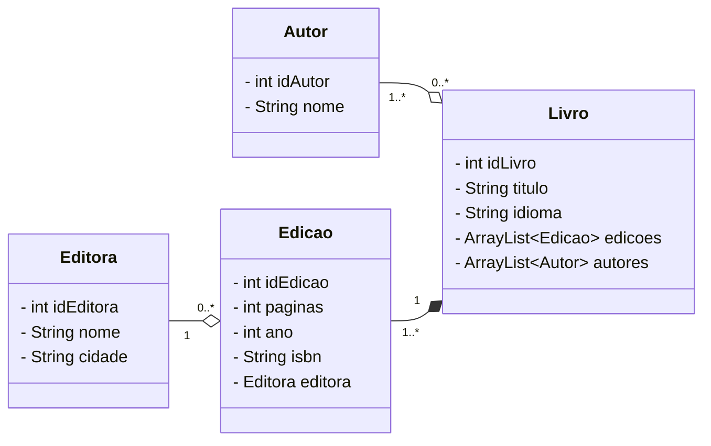
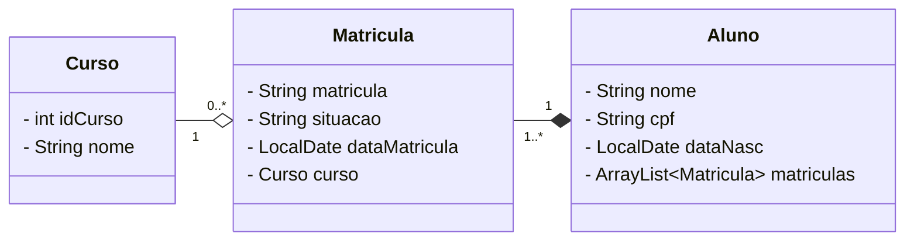
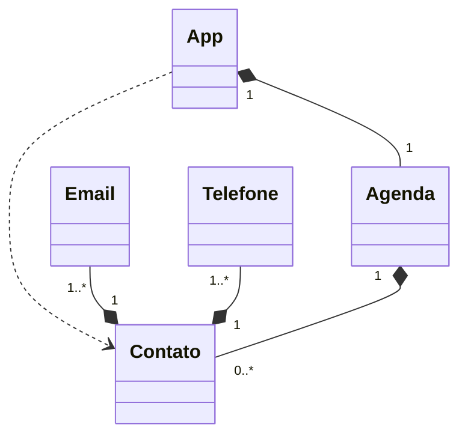

# Diagrama de Classes UML

## Sistema de Livros

### Diagrama UML

```mermaid
classDiagram
    direction LR

    class Livro {
        - int idLivro
        - String titulo
        - String idioma
        - ArrayList~Edicao~ edicoes
        - ArrayList~Autor~ autores
    }

    class Autor {
        - int idAutor
        - String nome
    }

    class Edicao {
        - int idEdicao
        - int paginas
        - int ano
        - String isbn
        - Editora editora
    }

    class Editora {
        - int idEditora
        - String nome
        - String cidade
    }

    Autor "1..*"--o"0..*" Livro
    Edicao "1..*"--*"1" Livro
    Editora "1"--o"0..*" Edicao
```

## Sistema Acadêmico

### Diagrama UML

```mermaid
classDiagram
    direction LR

    class Aluno { 
        - String nome
        - String cpf
        - LocalDate dataNasc
        - ArrayList~Matricula~ matriculas
    }

    class Matricula {
        - String matricula
        - String situacao
        - LocalDate dataMatricula
        - Curso curso
    }

    class Curso {
        - int idCurso
        - String nome
    }

    Matricula "1..*"--*"1" Aluno
    Curso "1"--o"0..*" Matricula
```

## Sistema para Gestão de Agenda Telefônica

### Diagrama UML

```mermaid
classDiagram

    class App {

    }

    class Contato {

    }

    class Telefone {

    }

    class Email {

    }

    class Agenda {

    }

    App ..> Contato
    App "1"*--"1" Agenda
    Email "1..*"--*"1" Contato
    Telefone "1..*"--*"1" Contato
    Agenda "1"*--"0..*" Contato 
```