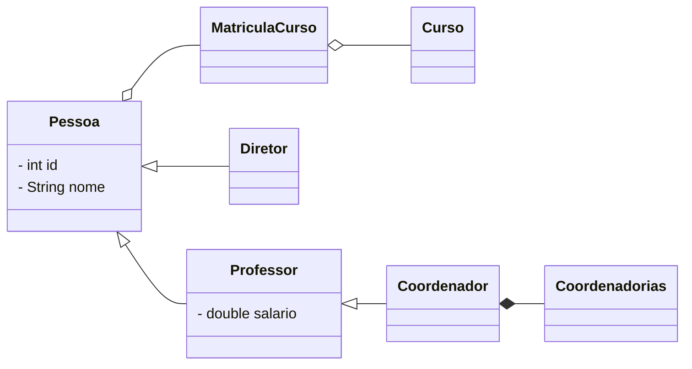
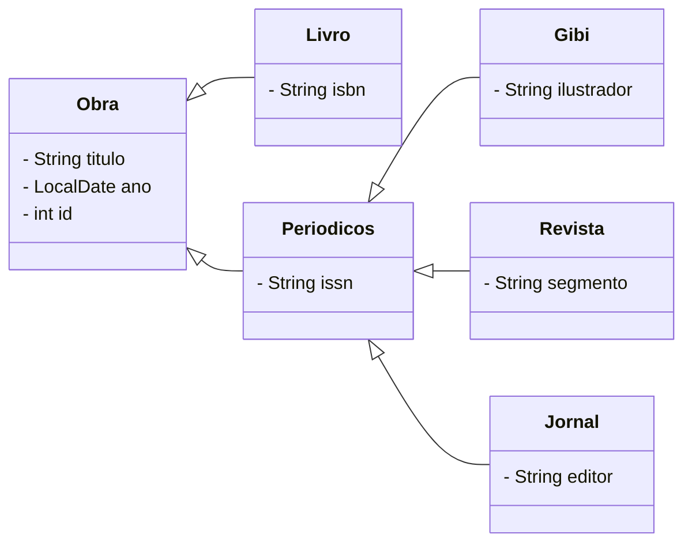
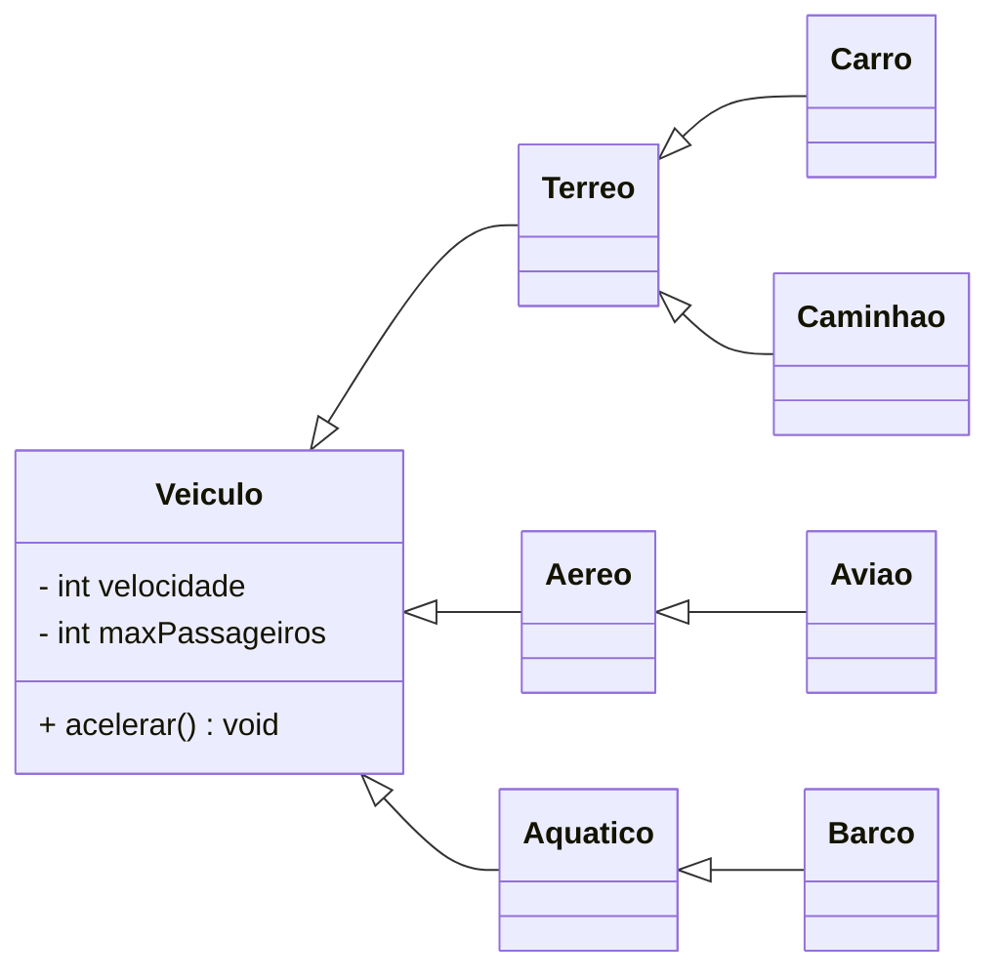

# Exercícios de Herança

## Sistema Acadêmico

### Diagrama UML

```mermaid
classDiagram 
    direction LR

    class Pessoa {
        - int id
        - String nome
    }

    class Professor {
        - double salario
    }

    Pessoa <|-- Diretor
    Pessoa <|-- Professor
    Pessoa o-- MatriculaCurso
    
    MatriculaCurso o-- Curso
    Professor <|-- Coordenador
    Coordenador *-- Coordenadorias
```

## Sistema de Livraria

### Diagrama UML

```mermaid
classDiagram
    direction LR

    class Obra {
        - String titulo
        - LocalDate ano
        - int id
    }

    class Livro {
        - String isbn

    }

    class Periodicos {
        - String issn
    }

    class Gibi {
        - String ilustrador
    }

    class Revista {
        - String segmento
    }

    class Jornal {
        - String editor
    }

    Obra <|-- Livro
    Obra <|-- Periodicos

    Periodicos <|-- Gibi
    Periodicos <|-- Revista
    Periodicos <|-- Jornal
```

## Jogo de Transporte

### Diagrama UML

```mermaid
classDiagram
    direction LR

    class Veiculo {
        - int velocidade
        - int maxPassageiros
        + acelerar() void 
    }

    class Terreo {

    }

    class Aereo {

    }

    class Aquatico {

    }

    class Aviao {

    }

    class Barco {

    }

    Veiculo <|-- Terreo
    Veiculo <|-- Aereo
    Veiculo <|-- Aquatico

    Terreo <|-- Carro
    Terreo <|-- Caminhao

    Aereo <|-- Aviao

    Aquatico <|-- Barco

```