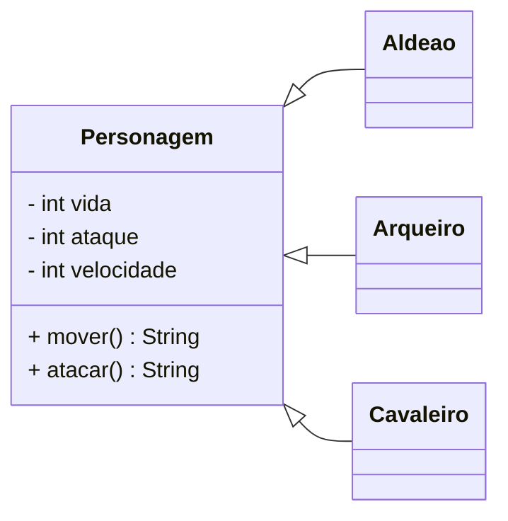

# Jogo Java of Empires

## Diagrama UML

```mermaid
classDiagram
    direction LR

    class Personagem {
        - int vida
        - int ataque
        - int velocidade
        + mover() String
        + atacar() String
    }

    Personagem <|-- Aldeao
    Personagem <|-- Arqueiro
    Personagem <|-- Cavaleiro
```
