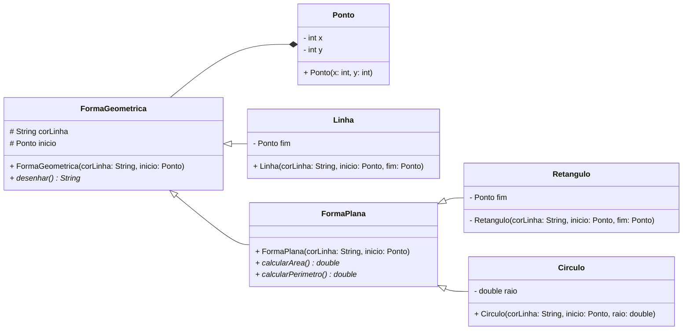

# Aplicativo para desenho vetorial 2D

## Diagrama UML

```mermaid
classDiagram
    direction LR

    class Ponto {
        - int x
        - int y
        + Ponto(x: int, y: int)
    }
    
    class FormaGeometrica {
        # String corLinha
        # Ponto inicio
        + FormaGeometrica(corLinha: String, inicio: Ponto)
        + desenhar() String *
    }

    class Linha {
        - Ponto fim
        + Linha(corLinha: String, inicio: Ponto, fim: Ponto)
    }

    class FormaPlana {
        + FormaPlana(corLinha: String, inicio: Ponto)
        + calcularArea() double *
        + calcularPerimetro() double *
    }

    class Circulo {
        - double raio
        + Circulo(corLinha: String, inicio: Ponto, raio: double)
    }

    class Retangulo {
        - Ponto fim
        - Retangulo(corLinha: String, inicio: Ponto, fim: Ponto)
    }

    FormaGeometrica <|-- FormaPlana
    FormaGeometrica <|-- Linha

    FormaPlana <|-- Retangulo
    FormaPlana <|-- Circulo

    FormaGeometrica --* Ponto

```