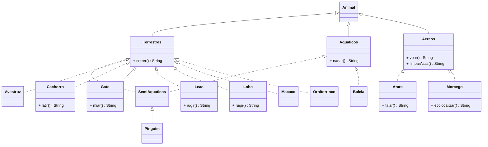

# Herança múltipla com Interfaces (Animais)

## Diagrama UML

```mermaid
classDiagram

    class Animal {

    }

    class Terrestres {
        + correr() String
    }

    class Aquaticos {
        + nadar() String
    }

    class SemiAquaticos {

    }

    class Aereos {
        + voar() String
        + limparAsas() String
    }

    class Arara {
        + falar() String
    }

    class Avestruz {
    }

    class Baleia {
    }

    class Cachorro {
        + latir() String
    }

    class Gato {
        + miar() String
    }

    class Leao {
        + rugir() String
    }

    class Lobo {
        + rugir() String
    }

    class Macaco {
    }

    class Morcego {
        + ecolocalizar() String
    }

    class Pinguim {

    }

    class Ornitorrinco {

    }

    Animal <|-- Terrestres
    Animal <|-- Aquaticos
    Animal <|-- Aereos

    Terrestres <|.. SemiAquaticos
    Aquaticos <|.. SemiAquaticos 

    Terrestres <|.. Avestruz
    Terrestres <|.. Cachorro
    Terrestres <|.. Gato
    Terrestres <|.. Leao
    Terrestres <|.. Lobo
    Terrestres <|.. Macaco
    Terrestres <|.. Ornitorrinco

    Aquaticos <|.. Baleia

    Aereos <|.. Arara
    Aereos <|.. Morcego

    SemiAquaticos <|-- Pinguim

```