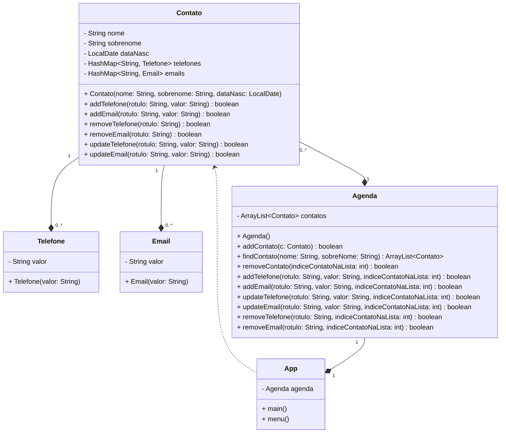

# Sistema para gestão de Agenda Telefônica

## Diagrama UML

```mermaid
classDiagram

    class App {
        - Agenda agenda
        + main()
        + menu()
    }

    class Contato {
        - String nome
        - String sobrenome
        - LocalDate dataNasc
        - HashMap~String, Telefone~ telefones
        - HashMap~String, Email~ emails
        + Contato(nome: String, sobrenome: String, dataNasc: LocalDate)
        + addTelefone(rotulo: String, valor: String) boolean
        + addEmail(rotulo: String, valor: String) boolean
        + removeTelefone(rotulo: String) boolean
        + removeEmail(rotulo: String) boolean
        + updateTelefone(rotulo: String, valor: String) boolean
        + updateEmail(rotulo: String, valor: String) boolean
    }

    class Telefone {
        - String valor
        + Telefone(valor: String)
    }

    class Email {
        - String valor
        + Email(valor: String)
    }

    class Agenda {
        - ArrayList~Contato~ contatos
        + Agenda()
        + addContato(c: Contato) boolean
        + findContato(nome: String, sobreNome: String) ArrayList~Contato~
        + removeContato(indiceContatoNaLista: int) boolean
        + addTelefone(rotulo: String, valor: String, indiceContatoNaLista: int) boolean
        + addEmail(rotulo: String, valor: String, indiceContatoNaLista: int) boolean
        + updateTelefone(rotulo: String, valor: String, indiceContatoNaLista: int) boolean
        + updateEmail(rotulo: String, valor: String, indiceContatoNaLista: int) boolean
        + removeTelefone(rotulo: String, indiceContatoNaLista: int) boolean
        + removeEmail(rotulo: String, indiceContatoNaLista: int) boolean
    }

    Contato "1"--*"0..*" Telefone
    Contato "1"--*"0..*" Email
    Contato "0..*"--*"1" Agenda
    Contato <.. App
    Agenda "1"--*"1" App


```