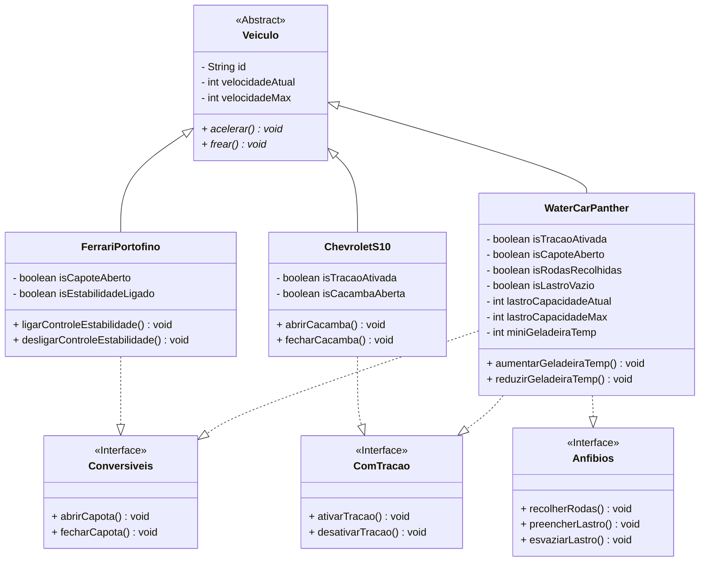

# Laboratório 6: Herança e Polimorfismo

## Diagrama UML

```mermaid
classDiagram

    class Veiculo {
        <<Abstract>>
        - String id
        - int velocidadeAtual
        - int velocidadeMax
        + acelerar() void *
        + frear() void *
    }

    class Anfibios {
        <<Interface>>
        + recolherRodas() void
        + preencherLastro() void
        + esvaziarLastro() void
    }

    class Conversiveis {
        <<Interface>>
        + abrirCapota() void
        + fecharCapota() void
    }

    class ComTracao {
        <<Interface>>
        + ativarTracao() void
        + desativarTracao() void
    }

    class FerrariPortofino {
        - boolean isCapoteAberto
        - boolean isEstabilidadeLigado
        + ligarControleEstabilidade() void
        + desligarControleEstabilidade() void
    }

    class ChevroletS10 {
        - boolean isTracaoAtivada
        - boolean isCacambaAberta
        + abrirCacamba() void
        + fecharCacamba() void
    }

    class WaterCarPanther {
        - boolean isTracaoAtivada
        - boolean isCapoteAberto
        - boolean isRodasRecolhidas
        - boolean isLastroVazio
        - int lastroCapacidadeAtual
        - int lastroCapacidadeMax
        - int miniGeladeiraTemp
        + aumentarGeladeiraTemp() void
        + reduzirGeladeiraTemp() void
    }

    Veiculo <|-- FerrariPortofino
    Veiculo <|-- ChevroletS10
    Veiculo <|-- WaterCarPanther

    FerrariPortofino ..|> Conversiveis
    
    ChevroletS10 ..|> ComTracao

    WaterCarPanther ..|> Anfibios
    WaterCarPanther ..|> Conversiveis
    WaterCarPanther ..|> ComTracao
```